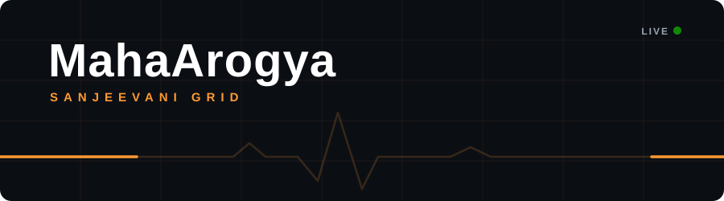
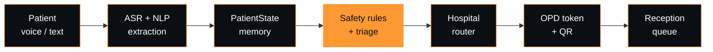

<div align="center">



<a href="https://git.io/typing-svg">
  
</a>

<br/>


</div>

---

## About

> **Statewide AI-driven healthcare routing, triage, and hospital management infrastructure for Maharashtra.**

**MahaArogya (Sanjeevani Grid)** is a privacy-first, GPU-accelerated subsystem for medical triage, hospital routing, OPD appointments, and bed occupancy management, built to integrate with Maharashtra's public health network.

A patient describes their problem by voice or text. The system understands it, decides how urgent it is, finds the right hospital, and issues a digital OPD token, all under strict, deterministic safety rules.

---

## Features

| | |
| :-- | :-- |
| 🎙️ **Multilingual voice & text intake** | GPU-accelerated speech-to-text and offline text-to-speech in Marathi, Hindi, English, and Romanized Marathi. |
| 🧠 **Deterministic PatientState memory** | A non-lossy state machine that tracks symptoms, vitals, history, duration, and severity across the whole conversation. |
| 🚨 **Safety-first triage engine** | Four-class triage with hard-coded safety red-flag overrides. |
| 🏥 **Hospital router & smart OPD tokens** | Haversine distance-weighted facility routing with QR-enabled digital OPD tokens. |
| 🗂️ **Offline reception workflow** | Patient check-in, queue status transitions, and tamper-evident audit logging. |
| 🛏️ **CCTV bed occupancy estimator** | Computer-vision bed estimates with mandatory human verification, no face recognition, and no patient PII. |
| 🔐 **Role-based access control** | Scoped access for Government, Doctor, Nurse, and Reception roles. |
| 📊 **Modern dashboard** | Next.js 16 glassmorphism UI with live patient state, interactive maps, chat, token issuing, and a reception queue. |

### Triage levels

| Level | Meaning |
| :-- | :-- |
| 🟢 `ROUTINE` | Can wait for a regular appointment |
| 🟡 `PRIORITY` | Should be seen soon |
| 🟠 `URGENT` | Needs prompt medical attention |
| 🔴 `EMERGENCY` | Immediate care required |

---

## How it works



---

## System architecture

The repository is split into clean, separate sub-systems:

| Folder | Purpose |
| :-- | :-- |
| `src/` | FastAPI backend, database schema, and RBAC middleware |
| `frontend/` | Next.js 16 frontend for Admin, Doctor, Nurse, Patient, and Government roles |
| `ai/` | ASR, NLP extraction, and triage pipelines |
| `tests/` · `evaluation/` | Integration tests and adversarial benchmark suites |
| `scripts/` | Development, training, and database management scripts |
| `docs/` | System design and audit documentation |
| `integration/` · `notebooks/` | Integration work and experiments |

Docker support is included through `Dockerfile` and `docker-compose.yml`.

---

## Quick start

### Prerequisites

- **Python** 3.11+
- **Node.js** v20+
- **GPU:** NVIDIA GPU (CUDA 12.8 recommended)

### 1. Start the backend

```bash
# Activate virtual environment
.\venv\Scripts\activate

# Start FastAPI on port 8000
python -m uvicorn src.api:app --reload --host 127.0.0.1 --port 8000
```

API docs (Swagger): **http://127.0.0.1:8000/docs**

### 2. Start the dashboard

```bash
cd frontend
npm install
npm run dev -- -p 3001
```

Dashboard: **http://localhost:3001**

### 3. Run the tests

```bash
python -m pytest ai/ src/ tests/
python evaluation/run_evaluations.py
```

---

## Safety & privacy principles

1. **Zero face recognition, zero patient PII.** CCTV bed monitoring works on bed-grid occupancy estimates only. No face detection, and no video is retained.
2. **Deterministic safety rules.** Generative models and classifiers must never override red-flag rules such as chest pain, severe breathlessness, or high fever in infants.
3. **CCTV is non-authoritative.** Its output is an estimate. Any mismatch with database records requires physical human verification.
4. **Scoped authority.** Hospital reception cannot modify clinical triage classifications.

---

## Data provenance

Data sources are catalogued in `data/source_registry.csv` and include `symptom_to_diagnosis`, `meditod`, `medquad`, `bc5cdr`, and `ncbi_disease`. All data acquisition follows licensing and regional compliance guidelines.

---

<div align="center">

**Built for faster, safer care across Maharashtra.**

Made by [Aditya Khubalkar](https://github.com/Aditya-Khubalkar)

</div>
