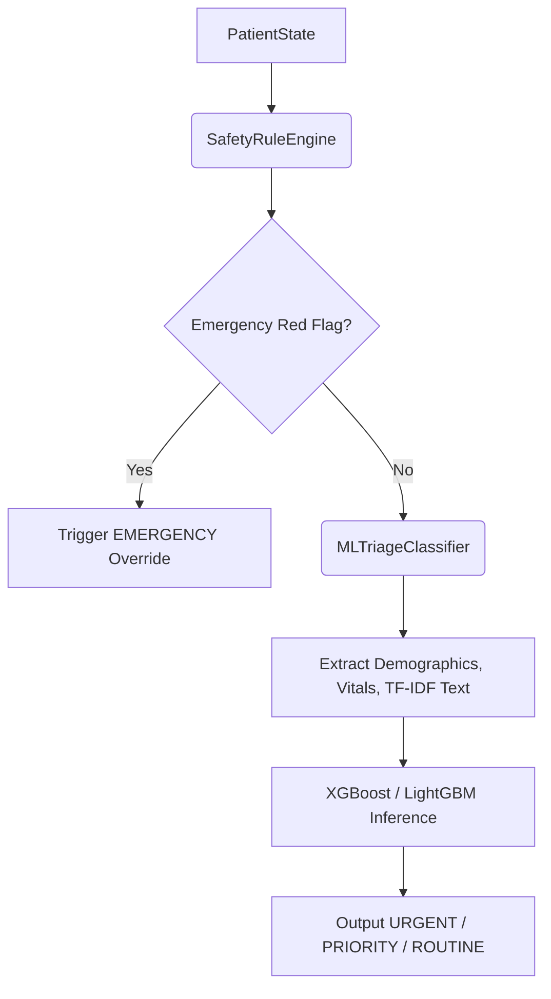

# MahaArogya Triage ML Integration

## 1. Overview
The deterministic `SafetyRuleEngine` has been integrated with the `MLTriageClassifier` (trained on NHAMCS). The ML model serves strictly as an intelligent fallback module for the non-emergency "gray area" cases, replacing the previous simplistic `_score_urgency` heuristics.

## 2. Architecture & Safety Flow

The highest authority is the `SafetyRuleEngine`. The ML model **never** receives or predicts on inputs that violate a deterministic Priority-1 red flag.

## 3. Model Loading & Inference
The service (`ai.triage.ml_classifier.MLTriageClassifier`) supports hot-swapping between the baseline XGBoost and LightGBM models.
- **Model Files:** `models/triage_xgboost_baseline/model.json`
- **Preprocessor:** `models/triage_xgboost_baseline/preprocessor.pkl`
- The `predict()` method maps the `PatientState` schema directly into a Pandas DataFrame and utilizes `sklearn.ColumnTransformer` for feature preprocessing (One-Hot Encoding, TF-IDF).

## 4. Feature Mapping
| PatientState Attribute | ML Feature | Missing Value Handling |
|---|---|---|
| `state.age_years` | `age` | Native NaN branching in XGBoost |
| `state.vitals.temperature_f`| `temperature`| Native NaN branching |
| `state.vitals.bp_systolic`| `systolic_bp`| Native NaN branching |
| `state.symptoms[x].severity`| `pain_score` | Derived numeric from 'mild/mod/severe' |
| `state.symptoms.keys()`| `chief_complaint_text` | TF-IDF frequency matrix |

## 5. Explainability
To maintain clinical transparency, the `predict()` output explicitly tracks the decision `source` and calculates simplified feature importance on the fly. 
Example Explanation Output:
`ML Routing: ROUTINE (xgboost_baseline). Primary contributing factors: presenting, pain_score, age`

## 6. Limitations & Rollback
- **Limitation:** The model currently lacks longitudinal patient history. It assesses urgency based on the immediate cross-sectional snapshot of vitals and symptoms.
- **Rollback Procedure:** If the ML model exhibits unexpected behavior, the codebase can be immediately reverted to the deterministic `_score_urgency` heuristics via Git, or the `TriageClassifier` can be modified to simply return `PRIORITY` for all non-emergency cases.
